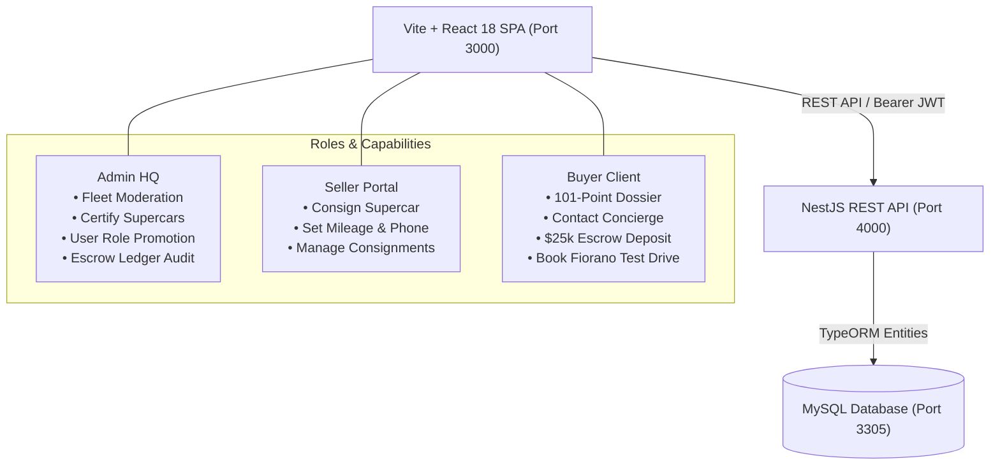

# 🏎️ SCUDERIA FERRARI SUPERCAR MARKETPLACE

[](https://www.typescriptlang.org/)
[](https://reactjs.org/)
[](https://vitejs.dev/)
[](https://nestjs.com/)
[](https://www.mysql.com/)
[](https://tailwindcss.com/)

> **A luxury, multi-role Supercar Marketplace & Interactive Showcase tailored for Maranello supercars and hypercars (SF90 XX Stradale, LaFerrari, Daytona SP3, F40, Enzo, and more). Built with verified digital odometers, official 101-point inspection certificates, direct dealer concierge phone routing, and cryptographic escrow reservation ledgers.**

---

## 📸 Platform Highlights

- **🔴 Scuderia Rosso Corsa & Nero Luxury Aesthetics**: Custom typography, dark-mode glassmorphism, carbon-fiber textures, and track-inspired micro-interactions.
- **🏎️ Verified Digital Odometer**: Every vehicle displays its certified mileage in exact miles (with factory-authenticated kilometer conversions).
- **📜 Ferrari Official 101-Point Inspection Certificate**: Complete inspection dossier detailing Powertrain, 3x e-Motor sync, 99.4% high-voltage battery health, carbon-ceramic disc thickness, and laser-calibrated spaceframe geometry.
- **📞 Direct Dealer & Seller Phone Routing**: Live click-to-call (`tel:`) and instant WhatsApp Concierge buttons on every supercar.
- **🔒 $25,000 Escrow Reservation Deposit**: Secure down-payment flow locking vehicle chassis with automated ledger auditing.
- **🏁 Fiorano Track Test Drive Concierge**: Book private track sessions at the Fiorano Circuit or Mugello International Circuit.
- **🛡️ Full Multi-Role Access**: Role-based access control (RBAC) with designated workflows for **Buyers**, **Sellers**, and **Admins**.

---

## 🏛️ System Architecture



---

## 🔑 Pre-Seeded Accounts (One-Click Login)

The platform features an instant one-click login selector or manual login with the credentials below:

| Role | Email | Password | Access Rights |
| :--- | :--- | :--- | :--- |
| **Admin HQ** | `admin@scuderia.com` | `admin123` | Fleet Management, User Promotion, Escrow Ledger, 101-Point Certification |
| **Seller** | `seller@scuderia.com` | `seller123` | Consignment submission (Mileage, Phone, Certificate, VIN), My Consignments |
| **Buyer** | `client@scuderia.com` | `client123` | Vehicle Dossier, Escrow Deposits, Fiorano Test Drives, Concierge Phone |

---

## 🏎️ 18-Supercar Curated Fleet

The platform comes pre-seeded with 18 authentic Maranello hypercars and supercars with realistic VINs, certificates, and dealer contacts:

1. **Ferrari SF90 XX Stradale Coupe** — `$945,000` | `85 mi` | `FER-APP-2024-001` | `+39 0536 949111`
2. **Ferrari SF90 Spider Assetto Fiorano** — `$695,000` | `450 mi` | `FER-APP-2024-002` | `+39 0536 949111`
3. **Ferrari SF90 Stradale Rosso Corsa** — `$585,000` | `1,200 mi` | `FER-APP-2024-003` | `+39 0536 949111`
4. **Ferrari 812 Competizione V12** — `$920,000` | `210 mi` | `FER-APP-2024-004` | `+39 0536 949111`
5. **Ferrari 812 GTS Spider** — `$475,000` | `1,650 mi` | `FER-APP-2024-005` | `+39 0536 949111`
6. **Ferrari 812 Superfast V12** — `$395,000` | `3,400 mi` | `FER-APP-2024-006` | `+39 0536 949111`
7. **Ferrari 296 GTB Assetto Fiorano** — `$410,000` | `920 mi` | `FER-APP-2024-007` | `+39 0536 949111`
8. **Ferrari 296 GTS Spider** — `$445,000` | `380 mi` | `FER-APP-2024-008` | `+39 0536 949111`
9. **Ferrari Daytona SP3 Icona Series** — `$2,650,000` | `310 mi` | `FER-APP-2024-009` | `+39 0536 949111`
10. **Ferrari Monza SP1 Single-Seater** — `$2,100,000` | `490 mi` | `FER-APP-2024-010` | `+39 0536 949111`
11. **Ferrari Monza SP2 Dual-Cockpit** — `$2,250,000` | `280 mi` | `FER-APP-2024-011` | `+39 0536 949111`
12. **Ferrari Purosangue V12 Super SUV** — `$430,000` | `1,100 mi` | `FER-APP-2024-012` | `+39 0536 949111`
13. **Ferrari LaFerrari Aperta Hypercar** — `$4,950,000` | `1,800 mi` | `FER-APP-2024-013` | `+39 0536 949111`
14. **Ferrari Enzo Hypercar Classic** — `$3,850,000` | `3,800 mi` | `FER-CLASSICHE-2004-014` | `+39 0536 949111`
15. **Ferrari F50 Formula 1 for the Road** — `$4,200,000` | `4,100 mi` | `FER-CLASSICHE-1996-015` | `+39 0536 949111`
16. **Ferrari F40 Twin-Turbo Legend** — `$2,850,000` | `6,200 mi` | `FER-CLASSICHE-1992-016` | `+39 0536 949111`
17. **Ferrari 488 Pista Piloti Special** — `$495,000` | `1,850 mi` | `FER-APP-2024-017` | `+39 0536 949111`
18. **Ferrari 458 Speciale Atmospheric** — `$460,000` | `4,800 mi` | `FER-APP-2024-018` | `+39 0536 949111`

---

## ⚙️ Prerequisites & Environment Setup

### 1. MySQL Database Configuration
The application is configured to connect to MySQL on **port 3305**:
- **Host**: `127.0.0.1`
- **Port**: `3305`
- **User**: `root`
- **Password**: `1234`
- **Database**: `supercar_marketplace`

*(Create database if not already created)*:
```sql
CREATE DATABASE IF NOT EXISTS supercar_marketplace CHARACTER SET utf8mb4 COLLATE utf8mb4_unicode_ci;
```

---

## 🚀 Quick Start Guide

### 1. Clone the Repository
```bash
git clone https://github.com/mikhailemad999/car-marketplace.git
cd car-marketplace
```

### 2. Start the Backend (NestJS)
```bash
cd backend
npm install
npm run build
node dist/main.js
```
The NestJS API will boot on `http://localhost:4000`, automatically synchronize TypeORM schema entities, and seed the initial fleet.

### 3. Start the Frontend (Vite + React)
```bash
cd ../frontend
npm install
npm run dev
```
Open your browser at `http://localhost:3000`.

---

## 📡 REST API Reference

### Authentication (`/auth`)
- `POST /auth/register` — Register a new account (Buyer / Seller) with phone and credentials.
- `POST /auth/login` — Authenticate and receive JWT access token.
- `GET /auth/me` — Retrieve authenticated user profile and permissions.

### Supercar Listings (`/listings`)
- `GET /listings` — Search & filter inventory by model, price, mileage, and certification.
- `GET /listings/:id` — Retrieve full vehicle dossier including 101-point inspection specs.
- `POST /listings` — Consign a new supercar (*Seller / Admin*).
- `PUT /listings/:id` — Update listing attributes (*Seller / Admin*).
- `DELETE /listings/:id` — Delete / Archive listing (*Seller / Admin*).

### Escrow & Reservations (`/payments`)
- `POST /payments` — Submit $25,000 escrow deposit to reserve a supercar chassis.
- `GET /payments/my` — Fetch current user's active deposits.
- `GET /payments` — Audit entire platform escrow ledger (*Admin*).

### Admin Command HQ (`/admin`)
- `GET /admin/analytics` — Platform metrics (Total inventory GMV, active escrow, users).
- `GET /admin/users` — List all registered users with phone numbers and roles.
- `PATCH /admin/users/:id/role` — Promote or demote user roles (`buyer`, `seller`, `admin`).
- `PATCH /admin/listings/:id/certify` — Issue or toggle official Ferrari 101-point certification.
- `DELETE /admin/listings/:id` — Moderator removal of listings.
- `GET /admin/payments` — Escrow transaction log.

---

## 🛠️ Tech Stack Details

| Layer | Technology |
| :--- | :--- |
| **Frontend Framework** | React 18 + Vite 5 |
| **Language** | TypeScript |
| **Styling** | Vanilla CSS + Tailwind CSS |
| **Iconography** | Lucide React |
| **Canvas & Interactive UI**| Three.js / Canvas Interactive Studio |
| **Backend Framework** | NestJS 10 |
| **ORM** | TypeORM |
| **Database** | MySQL 8 (Port `3305`) |
| **Security** | Passport JWT, bcryptjs, Class-Validator |

---

## 🏁 License

Developed for the **Scuderia Ferrari Supercar Marketplace**.
All rights reserved © 2026.
